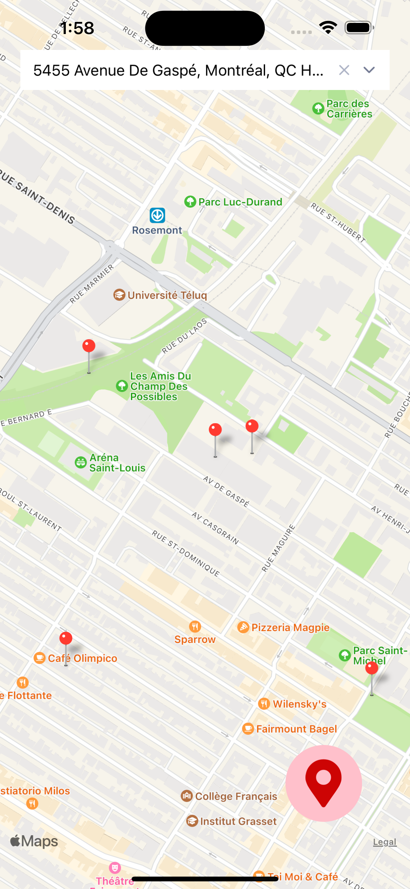

# Parking Aapp

L'objectif de cette application est de permettre à l'utilisateur de voir les places de parking disponible autour de lui.




## Commencez

D'abord, copiez le fichier `.env.example` en `.env` :
```bash
p .env.example .env
```
et remplir les variables d'environnements manquantes *(ex : la clé d'API)*

Puis, installez le dépendances :
```bash
npm install
```

Finalement, lancez l'application :
```bash
npm start
```

Vous pouvez ensuite choisir sur quel périphérique/platerforme [lancez l'app](https://docs.expo.dev/get-started/create-a-new-app/#opening-the-app-on-your-phonetablet) : votre téléphone, un émulateur, etc

## Fonctionnalités

- [x] Affichage d'une map
- [x] Possibilité de se déplacer grâce à un champs autocomplété
- [x] Géolocalisation de l'appareil
- [x] Affichage des places de parking (points générés aléatoirement autour de la position)

## Résultat

